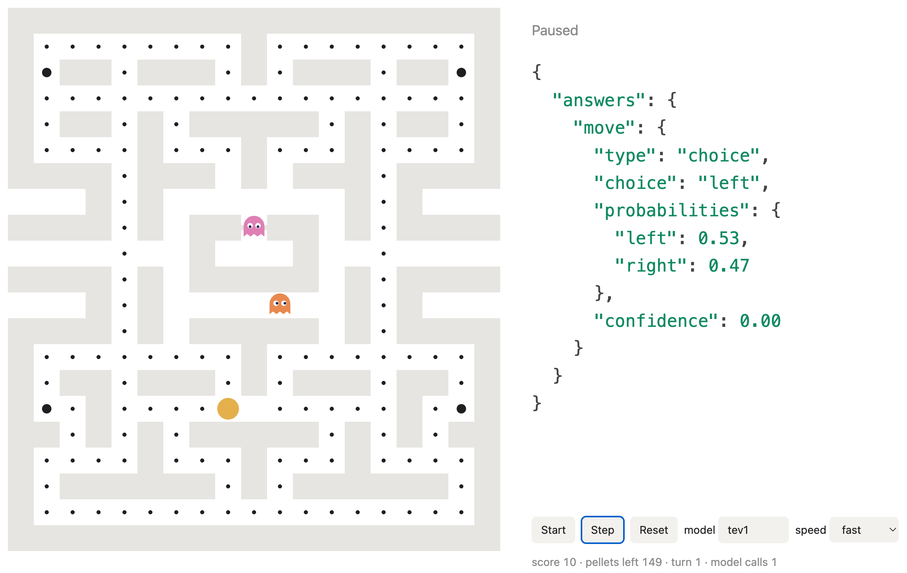

# Pacman · tev1

A Pacman game played by the local [tev1](https://ollama.com/library/tev1) model through Ollama's `/v1/systemone` endpoint. The model chooses every move. The browser shows the maze on the left and the model's latest answer as JSON on the right.



## Requirements

- [Ollama](https://ollama.com) running on `localhost:11434`
- The `tev1` model: `ollama pull tev1`
- Any static file server (the commands below use Python 3)

## Run

```sh
python3 -m http.server 8765
```

Open <http://localhost:8765> and press **Start**.

Serve the page from `localhost` instead of opening the file directly. Ollama accepts browser requests from localhost pages by default, so no proxy is needed.

## Controls

| Control | Action |
|---|---|
| **Start / Pause** | Run or pause the game loop |
| **Step** | Play a single turn while paused |
| **Reset** | Start a new game |
| **model** | Model name sent to Ollama (default `tev1`) |
| **speed** | Delay between turns: slow, normal or fast |
| **State sent to the model** | Shows the exact text from the latest request |

## How the model plays

The game is turn-based. On each tile, Pacman's open directions become the options of a single `choice` question:

```json
{
  "model": "tev1",
  "state": "You are Pacman in a maze. ...\n\nOptions:\n- left: nearest pellet 2 steps away; no ghosts nearby, safe.\n- right: nearest pellet 5 steps away; ghost Pinky only 3 steps away — DANGER, deadly; turns back.",
  "questions": {
    "move": {
      "type": "choice",
      "instructions": "Which direction should Pacman move next to eat pellets and stay away from dangerous ghosts?",
      "criteria": { "left": null, "right": null }
    }
  }
}
```

For each direction, the `state` text gives facts that the game measures by searching the maze from the tile in that direction:

- distance to the nearest pellet
- distance to the nearest power pellet, if it is 8 steps or fewer
- each ghost within 8 steps, marked **DANGER** at 3 steps or fewer, or **edible** during power mode
- whether the move turns back

The returned `answers.move.choice` is the move. The JSON panel shows its probabilities and confidence. When there is only one way to go (a dead end), Pacman moves without calling the model. If the answer is not one of the offered directions, Pacman takes the first open one.

## Rules

- Pellets are worth 10 points, power pellets 50, and eating a ghost 200.
- A power pellet frightens the ghosts for 30 turns. Frightened ghosts run away and can be eaten.
- **Pinky** aims 4 tiles ahead of Pacman. **Clyde** chases from far away and wanders off when close. Both move with some randomness.
- Ghosts skip every 4th turn, or every 2nd turn while frightened, so Pacman is slightly faster.
- The two side tunnels wrap around.
- Touching a ghost outside power mode ends the game. Eating every pellet wins it.

## Files

Everything is in `index.html`: the maze, game logic, rendering and model calls, with no dependencies. To change the maze, edit the `MAP` array. Use `#` for walls, `.` for pellets, `o` for power pellets, `-` for the ghost door and a space for empty floor.
